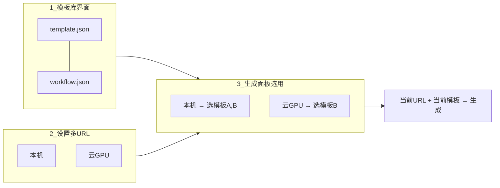
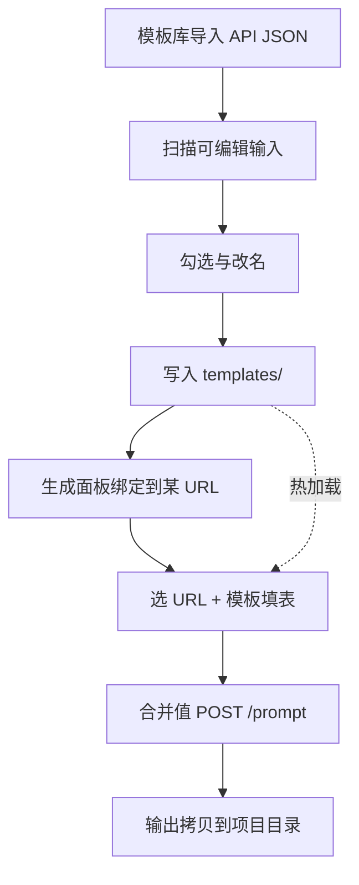

# ComfyUI 动态生成方案

> 状态：**目标模型实现中（模板库 + 多 URL 选用已落地；请用新 UI 验收）**  
> 最后更新：2026-09-07  
> 关联：[方案.md](./方案.md)（总方案里「ComfyUI API 内嵌」一项）

## 1. 目标

在 AIReelStudio 中接入 ComfyUI，要求：

- **不做** WebView 嵌网页，**不做** Flutter 节点编辑器  
- **只做** HTTP API：导入任意 ComfyUI **API Format** workflow JSON  
- **动态**：自动列出可选输入 → 勾选暴露 → 运行时表单由暴露字段驱动  
- **多 URL**：多台 Comfy 可并存；各 URL **各自选用**要用的模板  
- 配置跟项目走、可热加载；结果落盘到项目目录  

**一句话：** 项目级「Workflow 模板库」管图与暴露；全局「多 URL」管连哪；生成时「当前 URL + 当前模板」出结果。

---

## 2. 为何采用此路线

| 方式 | 评价 |
|---|---|
| WebView 嵌 Comfy | 与项目树 / 素材 / Agent 脱节 |
| 应用内重做节点图 | 成本过高 |
| 仅 Shell 启动 Comfy | 只解决进程，不解决「点一下出图」 |
| **模板 + 多 URL 选用 + API** | 任意 workflow、多机切换、结果落盘，与「文件系统为真相」一致 |

与 Agent 边界：文案 / 剧本走 Shell Agent；出图 / 出视频走 Comfy。一期不把「Agent 随便调 Comfy」当主路径。

### 2.1 为何不用「Action + profiles[serverId]」

过渡实现曾把「一份 workflow + 各 URL 各配暴露」塞进一个 Action，导致：

- 与「各 URL 选自己的 workflow」意图打架  
- 重新配置 / 删除语义不清（改模板还是改某 URL？删动作还是解绑？）  
- 在生成面板里「导入」易被理解成「给这个 URL 私有导入」  

故重梳为下面三块。

---

## 3. 目标模型（三块）



| 块 | 是什么 | 存哪 | 谁管 |
|---|---|---|---|
| **1. Workflow 模板** | API JSON + 节点暴露配置 | `.aireel/comfy/templates/` | **模板库界面**（导入 / 重配 / 删除） |
| **2. 多 URL** | 名称 / Base URL / API Key | 全局设置 | **设置 → Comfy** |
| **3. URL ↔ 模板选用** | 绑定列表 + 当前选中 | `.aireel/comfy/bindings.json` | **生成面板**（绑定 / 解绑 / 选用 / 生成） |

核心约定：

- 暴露配置**只跟模板走**，不再有 `profiles[serverId]`  
- 模板是项目**公共库**；URL 只决定「选用哪些」  
- **没有**「仅属于某 URL、不进模板库」的私有 workflow  
- 生成 = `当前 URL` + `该 URL 当前选中的模板`  

「绑定」与「导入」不是两套图：导入只进模板库；绑定只改 bindings。

---

## 4. 端到端流程



用户侧步骤：

1. ComfyUI 调好图 → **Save (API Format)**  
2. 打开 **模板库** → 导入 → 勾选暴露 → 保存（此时尚未绑任何 URL）  
3. **设置** 里配好多台 Comfy URL（如有）  
4. **生成** 面板：选 URL →「绑定…」勾选模板 → 选中一张 → 填表 → 生成  
5. 改暴露 / 删模板 → 只在 **模板库**；某 URL 不用某图 →「移出」解绑即可  

---

## 5. 输入发现规则（动态核心）

对 API JSON 中每个节点的 `inputs`：

| 值形态 | 处理 |
|---|---|
| 形如 `[nodeId, slot]` 的数组 | **跳过**（连线） |
| string / number / bool | **候选** |
| `LoadImage` 等的 `image` | 候选，类型 `image`（先 `/upload/image`） |
| 可能为枚举的字段 | 候选；在线时可 `/object_info` 补全 |

控件：`text` | `multiline` | `int` | `float` | `bool` | `image` | `audio` | `video` | `choice`

说明：

- **按节点归组**；启用/禁用是**节点级**  
- 禁用可 Bypass 的 Load* = 本次从 prompt 摘掉并断开引用  
- `/object_info` 为增强；Comfy 未启动仍可完成导入  

> API Format 导出不含已 Bypass 节点。要在本应用列出可选参考节点，请先在 Comfy 里保留 Load 节点再导出。

---

## 6. 落盘约定

相对**用户项目根**：

```
.aireel/comfy/
  templates/
    定妆文生图.template.json   # id / name / nodes / workflow 文件名 / hash
    定妆文生图.workflow.json
    场景图生图.template.json
    场景图生图.workflow.json
  bindings.json                # serverId → { templateIds, selectedTemplateId }
```

### 6.1 `*.template.json` 示意

```json
{
  "id": "tpl_定妆",
  "name": "定妆文生图",
  "workflow": "定妆文生图.workflow.json",
  "workflowHash": "可选",
  "nodes": [
    {
      "nodeId": "6",
      "label": "正向提示词",
      "classType": "CLIPTextEncode",
      "defaultEnabled": true,
      "bypassWhenDisabled": false,
      "fields": [
        {
          "id": "6_text",
          "label": "文本",
          "nodeId": "6",
          "inputKey": "text",
          "widget": "multiline"
        }
      ]
    }
  ]
}
```

### 6.2 `bindings.json` 示意

```json
{
  "local": {
    "templateIds": ["tpl_定妆", "tpl_场景"],
    "selectedTemplateId": "tpl_定妆"
  },
  "srv_cloud": {
    "templateIds": ["tpl_场景"],
    "selectedTemplateId": "tpl_场景"
  }
}
```

### 6.3 热加载 / 替换

| 场景 | 行为 |
|---|---|
| 模板库重新配置 | 只改该模板的 `nodes` / 可换 workflow；所有绑了它的 URL 共用新暴露 |
| 只换 workflow 文件 | 节点 id 变了则提示需在模板库重新配置 |
| 生成面板「移出」 | 只解绑，不删模板 |
| 模板库「删除」 | 删模板文件 + 清所有 URL 绑定 |
| 热加载 | 监视 `templates/` 与 `bindings.json` |

全局设置只存 **Comfy 实例列表**，不存具体 workflow。

### 6.4 从过渡版迁移

旧根目录 `*.action.json`（含 `profiles` / 顶层 `nodes` / `exposed`）：

- 合成一条模板（nodes 取 `_default` 或首个非空 profile）  
- `bindings` 里给现有各 server 各绑上该模板  

---

## 7. UI 规划

### 7.1 生成面板（左栏上下拆分）

URL 通常很少，不宜单列撑满。布局：

```
┌────────────────┬──────────────────────────────────┐
│ URL 列表（上）  │ 连接状态（当前 URL）      [生成]  │
│ · 本机 ✓       │ [展开][折叠]                      │
│ · 云 GPU       │ 表单（当前选中模板）               │
├────────────────┤                                  │
│ 模板列表（下）  │                                  │
│ 当前 URL 已绑： │                                  │
│ · 定妆（选中）  │                                  │
│ · 场景         │                                  │
│ [绑定…][模板库] │                                  │
└────────────────┴──────────────────────────────────┘
```

- **上半**：多 URL（约 30%～40%，可拖分割）  
- **下半**：当前 URL **已绑定**模板（不是全库）  
- **右侧**：当前 URL + 当前模板的连接与表单  
- **输出目录**在生成面板选（当前选中目录 / 浏览），不属于模板配置  

| 操作 | 放哪 | 含义 |
|---|---|---|
| 切 URL | 左上 | 换连接 + 换左下已绑列表 |
| 选用模板 | 左下点击 | 改该 URL 的 `selectedTemplateId` |
| **绑定…** | 左下头 | 从模板库多选加入当前 URL（**不导入 JSON**） |
| **移出** | 项菜单 | 仅解绑 |
| **模板库** | 左下头 | 打开独立管理界面 |
| **生成** | 右侧 | 当前 URL + 选中模板 |

生成面板**没有**：导入 API JSON、重新配置暴露、删除模板文件。

### 7.2 模板库（独立界面）

入口：生成面板左下 **「模板库」** → Dialog / 全页（**不**挂在某个 URL 上下文）。

| 操作 | 含义 |
|---|---|
| **导入** | API JSON → 暴露向导 → 写入 `templates/`（**不**自动绑 URL） |
| **重新配置** | 改 nodes / 可换 workflow |
| **删除模板** | 删文件 + 清所有 URL bindings |

向导只从模板库打开；标题不出现当前 URL 名。

### 7.3 设置 → Comfy

- 多实例：名称、Base URL、可选 API Key；增删改  
- 默认 `本机` → `http://127.0.0.1:8188`  
- 旧单字段 `comfyBaseUrl` / `comfyApiKey` 启动时迁为列表  
- Shell 快捷启动 ComfyUI **保留**（只拉进程）  

---

## 8. 运行时调用

1. 深拷贝选中模板的 `*.workflow.json`  
2. 按模板 `nodes` 将表单值写入对应输入；尊重节点级启用 / Bypass  
3. 媒体字段：先 `POST /upload/image`（等），再写入返回文件名  
4. `POST /prompt` → 一期轮询 `GET /history/{prompt_id}`  
5. `/view` 拉取产物，保存到所选输出目录；触发目录刷新  

错误在面板展示，不静默失败。客户端：`ComfyClient`（status / upload / prompt / history / view，可选 object_info）。

---

## 9. 与现有架构衔接

| 现有能力 | 用法 |
|---|---|
| 文件系统 = 唯一事实来源 | 模板、bindings、生成文件均在项目根下 |
| 项目树 / `selectedDir` / 素材网格 | 参考图来源、默认输出目录、结果浏览 |
| 目录刷新 tick | 外部写入后刷新 UI |
| Shell `StartCmd` | 启动 ComfyUI 进程 |
| SharedPreferences | 仅多 URL 实例列表等全局项 |

不引入 SQLite；不把 workflow 塞进 prefs。

---

## 10. 一期明确不做

- 嵌 Comfy 网页 / 节点可视化编辑 / 改连线  
- 同一模板按 URL 不同暴露（需要则复制成两个模板）  
- 生成面板内嵌导入；URL 私有、不进模板库的 workflow  
- 复杂批量清单；Agent 自动编排 Comfy 作主路径  

---

## 11. 建议实现顺序（重梳）

1. `ComfyTemplate` + `ComfyBindings` 落盘；弃用 Action.profiles  
2. Store + 热加载（`templates/`、`bindings.json`）  
3. **模板库 UI** + 向导只服务模板  
4. **生成面板**：左上 URL、左下已绑模板、右侧表单  
5. 旧 `*.action.json` 迁移  
6. `flutter analyze` + `flutter build windows --debug`  

主要代码：`lib/core/comfy/`、`lib/features/comfy/comfy_panel.dart`、导入向导、设置 Comfy 分区。

---

## 12. 风险与对策

| 风险 | 对策 |
|---|---|
| 候选输入过多 | 分组 +「常见/全部」筛选 |
| 替换 workflow 后节点 id 变化 | `workflowHash` 提示在模板库重新配置 |
| Comfy 与项目不在同一机器 | 上传走 Comfy 本机 input；产出再拷回项目根 |
| 自定义 / 未知 class_type | 按原始值类型启发式；未知当 text |

---

## 13. 实现状态

| 项 | 状态 |
|---|---|
| 本设计（三块模型 + 左栏上下拆） | ✅ |
| ComfyClient / 多 URL 设置 | ✅ |
| Template + bindings 落盘 / 旧 action 迁移 | ✅ |
| 模板库独立界面 + 向导 | ✅ |
| 生成面板左上 URL + 左下已绑模板 | ✅ |

*推进以本文目标模型为准。*
